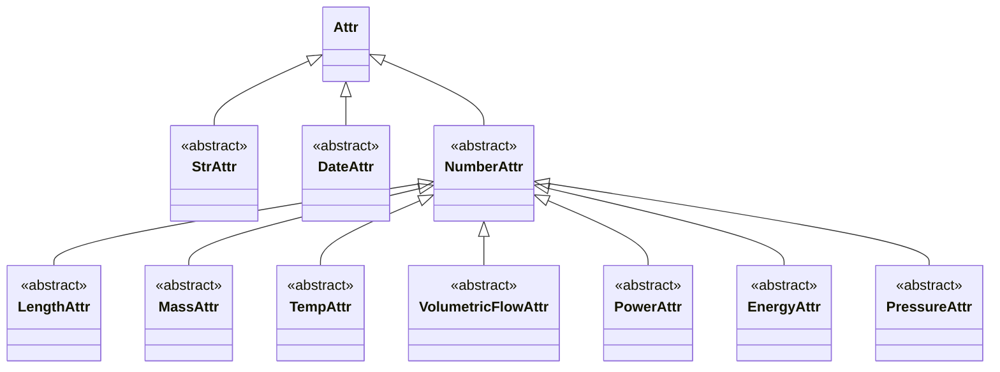

## Class Diagram

```mermaid
classDiagram
    Attr <|-- StrAttr
    Attr <|-- DateAttr
    Attr <|-- NumberAttr
    NumberAttr <|-- LengthAttr
    NumberAttr <|-- MassAttr
    NumberAttr <|-- TempAttr
    NumberAttr <|-- VolumetricFlowAttr
    NumberAttr <|-- PowerAttr
    NumberAttr <|-- EnergyAttr
    NumberAttr <|-- PressureAttr

    class StrAttr {
        <<abstract>>
    }
    class DateAttr {
        <<abstract>>
    }
    class NumberAttr {
        <<abstract>>
    }
    class LengthAttr {
        <<abstract>>
    }
    class MassAttr {
        <<abstract>>
    }
    class TempAttr {
        <<abstract>>
    }
    class VolumetricFlowAttr {
        <<abstract>>
    }
    class PowerAttr {
        <<abstract>>
    }
    class EnergyAttr {
        <<abstract>>
    }
    class PressureAttr {
        <<abstract>>
    }
```
