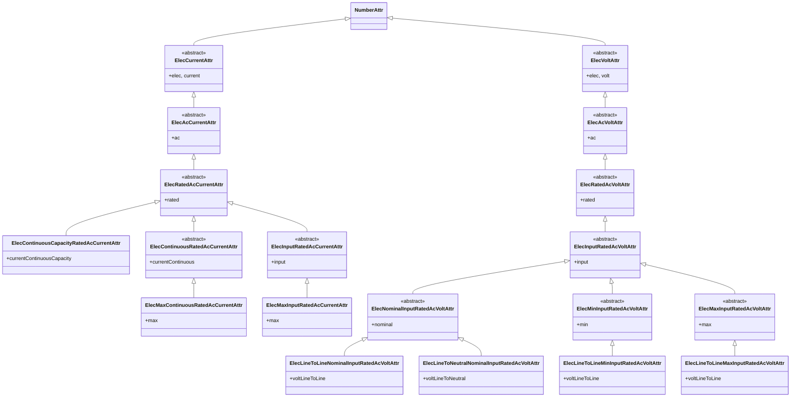

## Class Diagram

```mermaid
classDiagram
    NumberAttr <|-- ElecCurrentAttr
    ElecCurrentAttr <|-- ElecAcCurrentAttr
    ElecAcCurrentAttr <|-- ElecRatedAcCurrentAttr
    ElecRatedAcCurrentAttr <|-- ElecContinuousCapacityRatedAcCurrentAttr
    ElecRatedAcCurrentAttr <|-- ElecContinuousRatedAcCurrentAttr
    ElecContinuousRatedAcCurrentAttr <|-- ElecMaxContinuousRatedAcCurrentAttr
    ElecRatedAcCurrentAttr <|-- ElecInputRatedAcCurrentAttr
    ElecInputRatedAcCurrentAttr <|-- ElecMaxInputRatedAcCurrentAttr
    NumberAttr <|-- ElecVoltAttr
    ElecVoltAttr <|-- ElecAcVoltAttr
    ElecAcVoltAttr <|-- ElecRatedAcVoltAttr
    ElecRatedAcVoltAttr <|-- ElecInputRatedAcVoltAttr
    ElecInputRatedAcVoltAttr <|-- ElecNominalInputRatedAcVoltAttr
    ElecNominalInputRatedAcVoltAttr <|-- ElecLineToLineNominalInputRatedAcVoltAttr
    ElecNominalInputRatedAcVoltAttr <|-- ElecLineToNeutralNominalInputRatedAcVoltAttr
    ElecInputRatedAcVoltAttr <|-- ElecMinInputRatedAcVoltAttr
    ElecMinInputRatedAcVoltAttr <|-- ElecLineToLineMinInputRatedAcVoltAttr
    ElecInputRatedAcVoltAttr <|-- ElecMaxInputRatedAcVoltAttr
    ElecMaxInputRatedAcVoltAttr <|-- ElecLineToLineMaxInputRatedAcVoltAttr

    class ElecCurrentAttr {
        <<abstract>>
        +elec, current
    }
    class ElecAcCurrentAttr {
        <<abstract>>
        +ac
    }
    class ElecRatedAcCurrentAttr {
        <<abstract>>
        +rated
    }
    class ElecContinuousCapacityRatedAcCurrentAttr {
        +currentContinuousCapacity
    }
    class ElecContinuousRatedAcCurrentAttr {
        <<abstract>>
        +currentContinuous
    }
    class ElecMaxContinuousRatedAcCurrentAttr {
        +max
    }
    class ElecInputRatedAcCurrentAttr {
        <<abstract>>
        +input
    }
    class ElecMaxInputRatedAcCurrentAttr {
        +max
    }
    class ElecVoltAttr {
        <<abstract>>
        +elec, volt
    }
    class ElecAcVoltAttr {
        <<abstract>>
        +ac
    }
    class ElecRatedAcVoltAttr {
        <<abstract>>
        +rated
    }
    class ElecInputRatedAcVoltAttr {
        <<abstract>>
        +input
    }
    class ElecNominalInputRatedAcVoltAttr {
        <<abstract>>
        +nominal
    }
    class ElecLineToLineNominalInputRatedAcVoltAttr {
        +voltLineToLine
    }
    class ElecLineToNeutralNominalInputRatedAcVoltAttr {
        +voltLineToNeutral
    }
    class ElecMinInputRatedAcVoltAttr {
        <<abstract>>
        +min
    }
    class ElecLineToLineMinInputRatedAcVoltAttr {
        +voltLineToLine
    }
    class ElecMaxInputRatedAcVoltAttr {
        <<abstract>>
        +max
    }
    class ElecLineToLineMaxInputRatedAcVoltAttr {
        +voltLineToLine
    }
```
