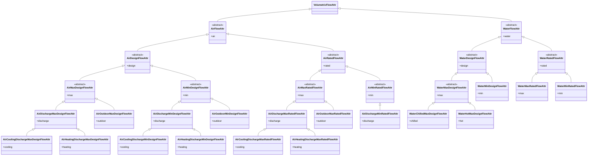

## Class Diagram

```mermaid
classDiagram
    VolumetricFlowAttr <|-- AirFlowAttr
    AirFlowAttr <|-- AirDesignFlowAttr
    AirDesignFlowAttr <|-- AirMaxDesignFlowAttr
    AirMaxDesignFlowAttr <|-- AirDischargeMaxDesignFlowAttr
    AirDischargeMaxDesignFlowAttr <|-- AirCoolingDischargeMaxDesignFlowAttr
    AirDischargeMaxDesignFlowAttr <|-- AirHeatingDischargeMaxDesignFlowAttr
    AirMaxDesignFlowAttr <|-- AirOutdoorMaxDesignFlowAttr
    AirDesignFlowAttr <|-- AirMinDesignFlowAttr
    AirMinDesignFlowAttr <|-- AirDischargeMinDesignFlowAttr
    AirDischargeMinDesignFlowAttr <|-- AirCoolingDischargeMinDesignFlowAttr
    AirDischargeMinDesignFlowAttr <|-- AirHeatingDischargeMinDesignFlowAttr
    AirMinDesignFlowAttr <|-- AirOutdoorMinDesignFlowAttr
    AirFlowAttr <|-- AirRatedFlowAttr
    AirRatedFlowAttr <|-- AirMaxRatedFlowAttr
    AirMaxRatedFlowAttr <|-- AirDischargeMaxRatedFlowAttr
    AirDischargeMaxRatedFlowAttr <|-- AirCoolingDischargeMaxRatedFlowAttr
    AirDischargeMaxRatedFlowAttr <|-- AirHeatingDischargeMaxRatedFlowAttr
    AirMaxRatedFlowAttr <|-- AirOutdoorMaxRatedFlowAttr
    AirRatedFlowAttr <|-- AirMinRatedFlowAttr
    AirMinRatedFlowAttr <|-- AirDischargeMinRatedFlowAttr
    VolumetricFlowAttr <|-- WaterFlowAttr
    WaterFlowAttr <|-- WaterDesignFlowAttr
    WaterFlowAttr <|-- WaterRatedFlowAttr
    WaterDesignFlowAttr <|-- WaterMaxDesignFlowAttr
    WaterMaxDesignFlowAttr <|-- WaterChilledMaxDesignFlowAttr
    WaterMaxDesignFlowAttr <|-- WaterHotMaxDesignFlowAttr
    WaterDesignFlowAttr <|-- WaterMinDesignFlowAttr
    WaterRatedFlowAttr <|-- WaterMaxRatedFlowAttr
    WaterRatedFlowAttr <|-- WaterMinRatedFlowAttr

    class AirFlowAttr {
        <<abstract>>
        +air
    }
    class AirDesignFlowAttr {
        <<abstract>>
        +design
    }
    class AirMaxDesignFlowAttr {
        <<abstract>>
        +max
    }
    class AirDischargeMaxDesignFlowAttr {
        +discharge
    }
    class AirCoolingDischargeMaxDesignFlowAttr {
        +cooling
    }
    class AirHeatingDischargeMaxDesignFlowAttr {
        +heating
    }
    class AirOutdoorMaxDesignFlowAttr {
        +outdoor
    }
    class AirMinDesignFlowAttr {
        <<abstract>>
        +min
    }
    class AirDischargeMinDesignFlowAttr {
        +discharge
    }
    class AirCoolingDischargeMinDesignFlowAttr {
        +cooling
    }
    class AirHeatingDischargeMinDesignFlowAttr {
        +heating
    }
    class AirOutdoorMinDesignFlowAttr {
        +outdoor
    }
    class AirRatedFlowAttr {
        <<abstract>>
        +rated
    }
    class AirMaxRatedFlowAttr {
        <<abstract>>
        +max
    }
    class AirDischargeMaxRatedFlowAttr {
        +discharge
    }
    class AirCoolingDischargeMaxRatedFlowAttr {
        +cooling
    }
    class AirHeatingDischargeMaxRatedFlowAttr {
        +heating
    }
    class AirOutdoorMaxRatedFlowAttr {
        +outdoor
    }
    class AirMinRatedFlowAttr {
        <<abstract>>
        +min
    }
    class AirDischargeMinRatedFlowAttr {
        +discharge
    }
    class WaterFlowAttr {
        <<abstract>>
        +water
    }
    class WaterDesignFlowAttr {
        <<abstract>>
        +design
    }
    class WaterRatedFlowAttr {
        <<abstract>>
        +rated
    }
    class WaterMaxDesignFlowAttr {
        <<abstract>>
        +max
    }
    class WaterChilledMaxDesignFlowAttr {
        +chilled
    }
    class WaterHotMaxDesignFlowAttr {
        +hot
    }
    class WaterMinDesignFlowAttr {
        +min
    }
    class WaterMaxRatedFlowAttr {
        +max
    }
    class WaterMinRatedFlowAttr {
        +min
    }
```
