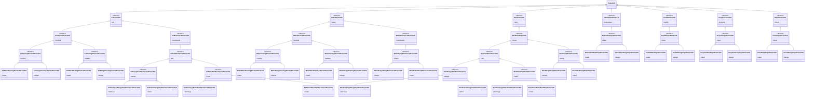

## Class Diagram

```mermaid
classDiagram
    PowerAttr <|-- AirPowerAttr
    AirPowerAttr <|-- AirThermalPowerAttr
    AirThermalPowerAttr <|-- AirCoolingThermalPowerAttr
    AirCoolingThermalPowerAttr <|-- AirRatedCoolingThermalPowerAttr
    AirCoolingThermalPowerAttr <|-- AirDesignCoolingThermalPowerAttr
    AirThermalPowerAttr <|-- AirHeatingThermalPowerAttr
    AirHeatingThermalPowerAttr <|-- AirRatedHeatingThermalPowerAttr
    AirHeatingThermalPowerAttr <|-- AirDesignHeatingThermalPowerAttr
    AirPowerAttr <|-- AirMechanicalPowerAttr
    AirMechanicalPowerAttr <|-- AirFanMechanicalPowerAttr
    AirFanMechanicalPowerAttr <|-- AirDesignFanMechanicalPowerAttr
    AirDesignFanMechanicalPowerAttr <|-- AirDischargeDesignFanMechanicalPowerAttr
    AirDesignFanMechanicalPowerAttr <|-- AirReturnDesignFanMechanicalPowerAttr
    AirFanMechanicalPowerAttr <|-- AirRatedFanMechanicalPowerAttr
    AirRatedFanMechanicalPowerAttr <|-- AirDischargeRatedFanMechanicalPowerAttr
    AirRatedFanMechanicalPowerAttr <|-- AirReturnRatedFanMechanicalPowerAttr
    PowerAttr <|-- WaterPowerAttr
    WaterPowerAttr <|-- WaterThermalPowerAttr
    WaterThermalPowerAttr <|-- WaterCoolingThermalPowerAttr
    WaterCoolingThermalPowerAttr <|-- WaterRatedCoolingThermalPowerAttr
    WaterCoolingThermalPowerAttr <|-- WaterDesignCoolingThermalPowerAttr
    WaterThermalPowerAttr <|-- WaterHeatingThermalPowerAttr
    WaterHeatingThermalPowerAttr <|-- WaterRatedHeatingThermalPowerAttr
    WaterHeatingThermalPowerAttr <|-- WaterDesignHeatingThermalPowerAttr
    WaterPowerAttr <|-- WaterMechanicalPowerAttr
    WaterMechanicalPowerAttr <|-- WaterPumpMechanicalPowerAttr
    WaterPumpMechanicalPowerAttr <|-- WaterDesignPumpMechanicalPowerAttr
    WaterPumpMechanicalPowerAttr <|-- WaterRatedPumpMechanicalPowerAttr
    PowerAttr <|-- ElecPowerAttr
    ElecPowerAttr <|-- ElecMotorPowerAttr
    ElecMotorPowerAttr <|-- ElecFanMotorPowerAttr
    ElecMotorPowerAttr <|-- ElecPumpMotorPowerAttr
    ElecFanMotorPowerAttr <|-- ElecDesignFanMotorPowerAttr
    ElecDesignFanMotorPowerAttr <|-- ElecDischargeDesignFanMotorPowerAttr
    ElecDesignFanMotorPowerAttr <|-- ElecReturnDesignFanMotorPowerAttr
    ElecPumpMotorPowerAttr <|-- ElecDesignPumpMotorPowerAttr
    ElecFanMotorPowerAttr <|-- ElecRatedFanMotorPowerAttr
    ElecRatedFanMotorPowerAttr <|-- ElecDischargeRatedFanMotorPowerAttr
    ElecRatedFanMotorPowerAttr <|-- ElecReturnRatedFanMotorPowerAttr
    ElecPumpMotorPowerAttr <|-- ElecRatedPumpMotorPowerAttr
    PowerAttr <|-- NaturalGasPowerAttr
    NaturalGasPowerAttr <|-- NaturalGasInputPowerAttr
    NaturalGasInputPowerAttr <|-- NaturalGasRatedInputPowerAttr
    NaturalGasInputPowerAttr <|-- NaturalGasDesignInputPowerAttr
    PowerAttr <|-- FuelOilPowerAttr
    FuelOilPowerAttr <|-- FuelOilInputPowerAttr
    FuelOilInputPowerAttr <|-- FuelOilRatedInputPowerAttr
    FuelOilInputPowerAttr <|-- FuelOilDesignInputPowerAttr
    PowerAttr <|-- PropanePowerAttr
    PropanePowerAttr <|-- PropaneInputPowerAttr
    PropaneInputPowerAttr <|-- PropaneRatedInputPowerAttr
    PropaneInputPowerAttr <|-- PropaneDesignInputPowerAttr
    PowerAttr <|-- DieselPowerAttr
    DieselPowerAttr <|-- DieselInputPowerAttr
    DieselInputPowerAttr <|-- DieselRatedInputPowerAttr
    DieselInputPowerAttr <|-- DieselDesignInputPowerAttr

    class AirPowerAttr {
        <<abstract>>
        +air
    }
    class AirThermalPowerAttr {
        <<abstract>>
        +thermal
    }
    class AirCoolingThermalPowerAttr {
        <<abstract>>
        +cooling
    }
    class AirRatedCoolingThermalPowerAttr {
        +rated
    }
    class AirDesignCoolingThermalPowerAttr {
        +design
    }
    class AirHeatingThermalPowerAttr {
        <<abstract>>
        +heating
    }
    class AirRatedHeatingThermalPowerAttr {
        +rated
    }
    class AirDesignHeatingThermalPowerAttr {
        +design
    }
    class AirMechanicalPowerAttr {
        <<abstract>>
        +mechanical
    }
    class AirFanMechanicalPowerAttr {
        <<abstract>>
        +fan
    }
    class AirDesignFanMechanicalPowerAttr {
        <<abstract>>
        +design
    }
    class AirDischargeDesignFanMechanicalPowerAttr {
        +discharge
    }
    class AirReturnDesignFanMechanicalPowerAttr {
        +return
    }
    class AirRatedFanMechanicalPowerAttr {
        <<abstract>>
        +rated
    }
    class AirDischargeRatedFanMechanicalPowerAttr {
        +discharge
    }
    class AirReturnRatedFanMechanicalPowerAttr {
        +return
    }
    class WaterPowerAttr {
        <<abstract>>
        +water
    }
    class WaterThermalPowerAttr {
        <<abstract>>
        +thermal
    }
    class WaterCoolingThermalPowerAttr {
        <<abstract>>
        +cooling
    }
    class WaterRatedCoolingThermalPowerAttr {
        +rated
    }
    class WaterDesignCoolingThermalPowerAttr {
        +design
    }
    class WaterHeatingThermalPowerAttr {
        <<abstract>>
        +heating
    }
    class WaterRatedHeatingThermalPowerAttr {
        +rated
    }
    class WaterDesignHeatingThermalPowerAttr {
        +design
    }
    class WaterMechanicalPowerAttr {
        <<abstract>>
        +mechanical
    }
    class WaterPumpMechanicalPowerAttr {
        <<abstract>>
        +pump
    }
    class WaterDesignPumpMechanicalPowerAttr {
        +design
    }
    class WaterRatedPumpMechanicalPowerAttr {
        +rated
    }
    class ElecPowerAttr {
        <<abstract>>
        +elec
    }
    class ElecMotorPowerAttr {
        <<abstract>>
        +motor
    }
    class ElecFanMotorPowerAttr {
        <<abstract>>
        +fan
    }
    class ElecPumpMotorPowerAttr {
        <<abstract>>
        +pump
    }
    class ElecDesignFanMotorPowerAttr {
        <<abstract>>
        +design
    }
    class ElecDischargeDesignFanMotorPowerAttr {
        +discharge
    }
    class ElecReturnDesignFanMotorPowerAttr {
        +return
    }
    class ElecDesignPumpMotorPowerAttr {
        +design
    }
    class ElecRatedFanMotorPowerAttr {
        <<abstract>>
        +rated
    }
    class ElecDischargeRatedFanMotorPowerAttr {
        +discharge
    }
    class ElecReturnRatedFanMotorPowerAttr {
        +return
    }
    class ElecRatedPumpMotorPowerAttr {
        +rated
    }
    class NaturalGasPowerAttr {
        <<abstract>>
        +naturalGas
    }
    class NaturalGasInputPowerAttr {
        <<abstract>>
        +input
    }
    class NaturalGasRatedInputPowerAttr {
        +rated
    }
    class NaturalGasDesignInputPowerAttr {
        +design
    }
    class FuelOilPowerAttr {
        <<abstract>>
        +fuelOil
    }
    class FuelOilInputPowerAttr {
        <<abstract>>
        +input
    }
    class FuelOilRatedInputPowerAttr {
        +rated
    }
    class FuelOilDesignInputPowerAttr {
        +design
    }
    class PropanePowerAttr {
        <<abstract>>
        +propane
    }
    class PropaneInputPowerAttr {
        <<abstract>>
        +input
    }
    class PropaneRatedInputPowerAttr {
        +rated
    }
    class PropaneDesignInputPowerAttr {
        +design
    }
    class DieselPowerAttr {
        <<abstract>>
        +diesel
    }
    class DieselInputPowerAttr {
        <<abstract>>
        +input
    }
    class DieselRatedInputPowerAttr {
        +rated
    }
    class DieselDesignInputPowerAttr {
        +design
    }
```
