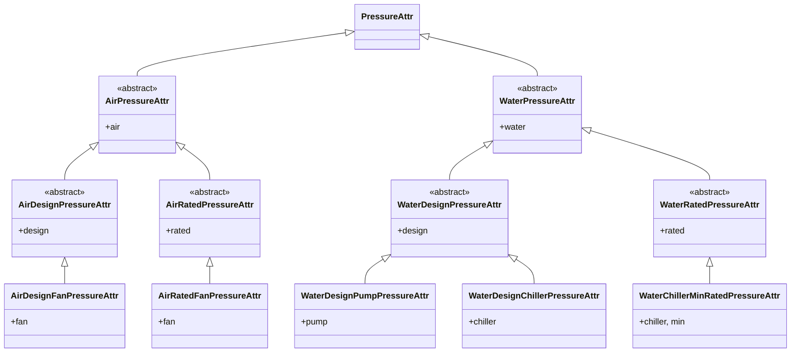

## Class Diagram

```mermaid
classDiagram
    PressureAttr <|-- AirPressureAttr
    AirPressureAttr <|-- AirDesignPressureAttr
    AirDesignPressureAttr <|-- AirDesignFanPressureAttr
    AirPressureAttr <|-- AirRatedPressureAttr
    AirRatedPressureAttr <|-- AirRatedFanPressureAttr
    PressureAttr <|-- WaterPressureAttr
    WaterPressureAttr <|-- WaterDesignPressureAttr
    WaterDesignPressureAttr <|-- WaterDesignPumpPressureAttr
    WaterDesignPressureAttr <|-- WaterDesignChillerPressureAttr
    WaterPressureAttr <|-- WaterRatedPressureAttr
    WaterRatedPressureAttr <|-- WaterChillerMinRatedPressureAttr

    class AirPressureAttr {
        <<abstract>>
        +air
    }
    class AirDesignPressureAttr {
        <<abstract>>
        +design
    }
    class AirDesignFanPressureAttr {
        +fan
    }
    class AirRatedPressureAttr {
        <<abstract>>
        +rated
    }
    class AirRatedFanPressureAttr {
        +fan
    }
    class WaterPressureAttr {
        <<abstract>>
        +water
    }
    class WaterDesignPressureAttr {
        <<abstract>>
        +design
    }
    class WaterDesignPumpPressureAttr {
        +pump
    }
    class WaterDesignChillerPressureAttr {
        +chiller
    }
    class WaterRatedPressureAttr {
        <<abstract>>
        +rated
    }
    class WaterChillerMinRatedPressureAttr {
        +chiller, min
    }
```
