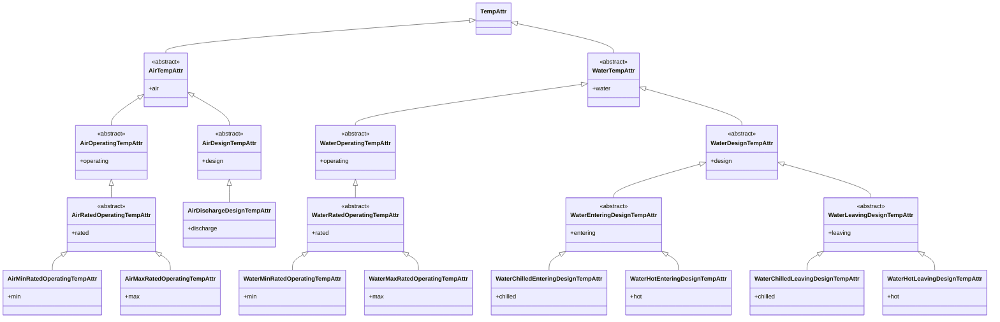

## Class Diagram

```mermaid
classDiagram
    TempAttr <|-- AirTempAttr
    AirTempAttr <|-- AirOperatingTempAttr
    AirOperatingTempAttr <|-- AirRatedOperatingTempAttr
    AirRatedOperatingTempAttr <|-- AirMinRatedOperatingTempAttr
    AirRatedOperatingTempAttr <|-- AirMaxRatedOperatingTempAttr
    AirTempAttr <|-- AirDesignTempAttr
    AirDesignTempAttr <|-- AirDischargeDesignTempAttr
    TempAttr <|-- WaterTempAttr
    WaterTempAttr <|-- WaterOperatingTempAttr
    WaterOperatingTempAttr <|-- WaterRatedOperatingTempAttr
    WaterRatedOperatingTempAttr <|-- WaterMinRatedOperatingTempAttr
    WaterRatedOperatingTempAttr <|-- WaterMaxRatedOperatingTempAttr
    WaterTempAttr <|-- WaterDesignTempAttr
    WaterDesignTempAttr <|-- WaterEnteringDesignTempAttr
    WaterEnteringDesignTempAttr <|-- WaterChilledEnteringDesignTempAttr
    WaterEnteringDesignTempAttr <|-- WaterHotEnteringDesignTempAttr
    WaterDesignTempAttr <|-- WaterLeavingDesignTempAttr
    WaterLeavingDesignTempAttr <|-- WaterChilledLeavingDesignTempAttr
    WaterLeavingDesignTempAttr <|-- WaterHotLeavingDesignTempAttr

    class AirTempAttr {
        <<abstract>>
        +air
    }
    class AirOperatingTempAttr {
        <<abstract>>
        +operating
    }
    class AirRatedOperatingTempAttr {
        <<abstract>>
        +rated
    }
    class AirMinRatedOperatingTempAttr {
        +min
    }
    class AirMaxRatedOperatingTempAttr {
        +max
    }
    class AirDesignTempAttr {
        <<abstract>>
        +design
    }
    class AirDischargeDesignTempAttr {
        +discharge
    }
    class WaterTempAttr {
        <<abstract>>
        +water
    }
    class WaterOperatingTempAttr {
        <<abstract>>
        +operating
    }
    class WaterRatedOperatingTempAttr {
        <<abstract>>
        +rated
    }
    class WaterMinRatedOperatingTempAttr {
        +min
    }
    class WaterMaxRatedOperatingTempAttr {
        +max
    }
    class WaterDesignTempAttr {
        <<abstract>>
        +design
    }
    class WaterEnteringDesignTempAttr {
        <<abstract>>
        +entering
    }
    class WaterChilledEnteringDesignTempAttr {
        +chilled
    }
    class WaterHotEnteringDesignTempAttr {
        +hot
    }
    class WaterLeavingDesignTempAttr {
        <<abstract>>
        +leaving
    }
    class WaterChilledLeavingDesignTempAttr {
        +chilled
    }
    class WaterHotLeavingDesignTempAttr {
        +hot
    }
```
