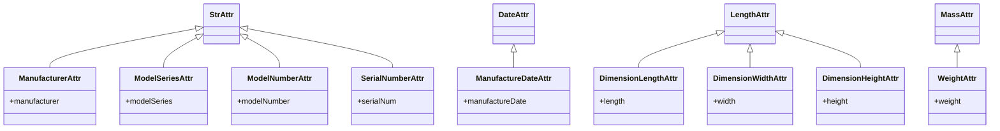

## Class Diagram

```mermaid
classDiagram
    StrAttr <|-- ManufacturerAttr
    StrAttr <|-- ModelSeriesAttr
    StrAttr <|-- ModelNumberAttr
    StrAttr <|-- SerialNumberAttr
    DateAttr <|-- ManufactureDateAttr
    LengthAttr <|-- DimensionLengthAttr
    LengthAttr <|-- DimensionWidthAttr
    LengthAttr <|-- DimensionHeightAttr
    MassAttr <|-- WeightAttr

    class ManufacturerAttr {
        +manufacturer
    }
    class ModelSeriesAttr {
        +modelSeries
    }
    class ModelNumberAttr {
        +modelNumber
    }
    class SerialNumberAttr {
        +serialNum
    }
    class ManufactureDateAttr {
        +manufactureDate
    }
    class DimensionLengthAttr {
        +length
    }
    class DimensionWidthAttr {
        +width
    }
    class DimensionHeightAttr {
        +height
    }
    class WeightAttr {
        +weight
    }
```
